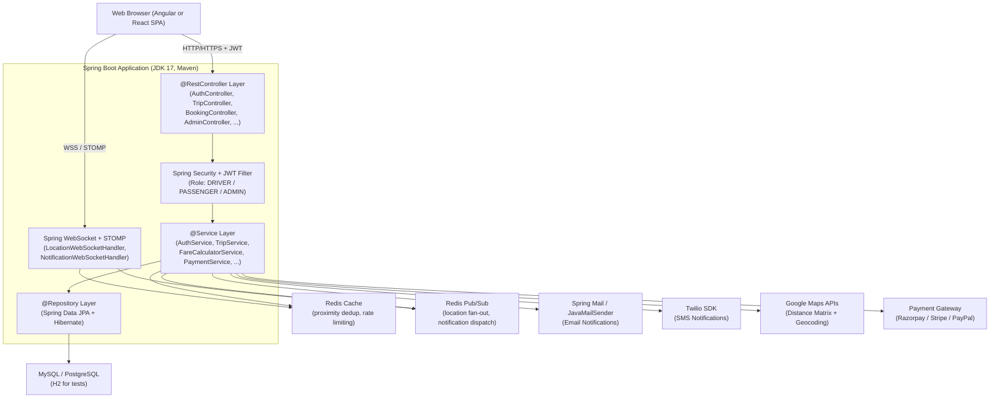
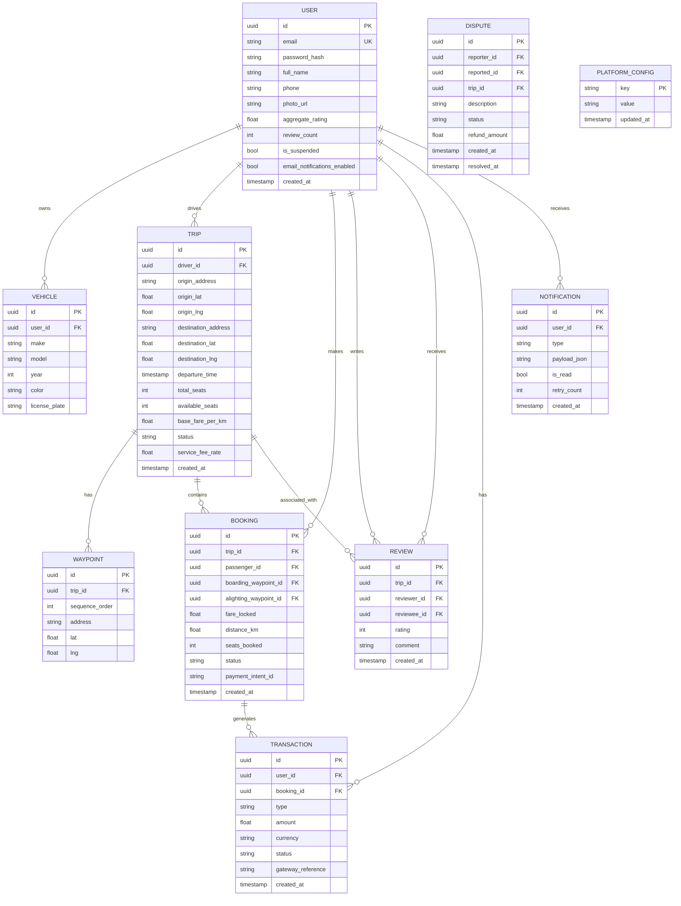

# Design Document: Smart Ride Sharing System

## Overview

The Smart Ride Sharing System is a web-based platform that connects drivers making long-distance trips with passengers traveling in the same direction. The platform handles the full lifecycle: user registration and authentication, trip posting with geocoded routes, passenger search and booking, dynamic fare calculation, secure payment with escrow, real-time GPS tracking, post-trip reviews, notifications, and admin oversight.

The system is designed as a Spring Boot monolith with clearly separated service layers, backed by a relational database and a real-time messaging layer for tracking and notifications. The architecture prioritizes correctness of financial transactions, consistency of seat availability, and reliability of notifications.

### Key Design Goals

- Seat availability must be consistent under concurrent booking attempts (no overbooking)
- Fares must be locked at booking confirmation and never retroactively changed
- Payments must be held in escrow and only released on trip completion
- Real-time tracking updates must reach passengers within the latency bounds specified in requirements
- All user-facing errors must be descriptive and actionable

---

## Architecture

The system is built as a **Spring Boot monolith** (JDK 17+, Maven) with a layered architecture: Controller → Service → Repository. Spring Security with JWT enforces role-based access control (DRIVER / PASSENGER / ADMIN). Spring Data JPA + Hibernate manages all database interactions with MySQL or PostgreSQL. A Spring WebSocket + STOMP server handles real-time tracking and in-platform notifications, with Redis Pub/Sub decoupling location fan-out.



### Tech Stack Summary

| Layer | Technology |
|---|---|
| Language & Runtime | Java 17+, JDK 17 |
| Build Tool | Maven (`pom.xml`) |
| Web Framework | Spring Boot 3.x + Spring Web (`@RestController`) |
| Security | Spring Security + JWT (role-based: DRIVER / PASSENGER / ADMIN) |
| ORM / Data Access | Spring Data JPA + Hibernate (`@Entity`, `@Repository`) |
| Database (prod) | MySQL or PostgreSQL (intern's choice) |
| Database (test) | H2 in-memory |
| Real-Time | Spring WebSocket + STOMP; Redis Pub/Sub for fan-out |
| Caching | Redis |
| Email | Spring Mail (`JavaMailSender`) |
| SMS | Twilio SDK |
| Maps | Google Maps Distance Matrix API + Geocoding API |
| Payment | Razorpay, Stripe, or PayPal (intern's choice) |
| Validation | Bean Validation (`@Valid`, `@NotNull`, `@Size`, etc.) |
| Password Hashing | BCrypt (`BCryptPasswordEncoder`, cost ≥ 12) |
| API Docs | Swagger / OpenAPI (`springdoc-openapi`) |
| Utilities | Lombok (optional) |
| IDE | IntelliJ IDEA / Eclipse / STS |
| API Testing | Postman / Thunder Client |
| DB Tools | MySQL Workbench / PgAdmin / H2 Console |

### Component Responsibilities

| Component | Spring Boot Class / Annotation | Responsibility |
|---|---|---|
| REST Controllers | `@RestController` | Handle HTTP requests; validate input with `@Valid`; delegate to service layer |
| Security Filter | Spring Security + JWT Filter | Authenticate every request; enforce DRIVER / PASSENGER / ADMIN roles |
| Service Layer | `@Service` | Business logic; orchestrate repositories, external APIs, and notifications |
| Repository Layer | `@Repository` (Spring Data JPA) | All database interactions via JPA/Hibernate; no raw SQL |
| Global Exception Handler | `@ControllerAdvice` | Translate exceptions to consistent JSON error envelopes |
| WebSocket Handler | `@Controller` + STOMP | Push real-time driver position updates and in-platform notifications |
| MySQL / PostgreSQL | JPA `@Entity` / `@Table` | Primary persistent store for all domain data |
| Redis Cache | `RedisTemplate` | Proximity alert deduplication, rate limiting, popular ride cache |
| Redis Pub/Sub | `RedisMessageListenerContainer` | Decouple location updates from WebSocket fan-out; notification dispatch |
| Google Maps APIs | `RestTemplate` / `WebClient` | Geocoding addresses; computing road distances between waypoints |
| Payment Gateway | Razorpay / Stripe / PayPal SDK | Tokenize payment methods; process charges, holds, releases, and refunds |
| Spring Mail | `JavaMailSender` | Deliver email notifications |
| Twilio SDK | `TwilioRestClient` | Deliver SMS notifications |

---

## Components and Interfaces

### 1. User Management Module

Handles registration, authentication, profile management, and role assignment.

**Spring Boot Classes:**
- `AuthController` (`@RestController`, `/auth/**`) — registration, login, logout, password reset
- `UserController` (`@RestController`, `/users/**`) — profile read/update, vehicle details
- `AuthService` (`@Service`) — password hashing, JWT issuance, token validation
- `UserService` (`@Service`) — profile management, vehicle management
- `UserRepository` (`@Repository`) — Spring Data JPA for `User` entity
- `VehicleRepository` (`@Repository`) — Spring Data JPA for `Vehicle` entity
- `JwtAuthenticationFilter` — Spring Security filter; validates JWT on every request
- `RegisterRequestDTO`, `LoginRequestDTO`, `UserProfileDTO`, `VehicleDTO` — request/response DTOs

**Interfaces:**
- `POST /auth/register` — create account (`@Valid RegisterRequestDTO`)
- `POST /auth/login` — authenticate, return JWT
- `POST /auth/logout` — invalidate session token
- `POST /auth/password-reset/request` — send reset link
- `POST /auth/password-reset/confirm` — apply new password
- `GET /users/{id}` — public profile
- `PATCH /users/me` — update own profile (name, phone, photo)
- `PUT /users/me/vehicle` — add/update vehicle details

**AuthService responsibilities:**
- Hash passwords with `BCryptPasswordEncoder` (cost factor ≥ 12)
- Issue JWT session tokens with 24-hour expiry
- Validate reset tokens (HMAC-signed, 60-minute TTL)
- Enforce single-error response for invalid credentials (no field disclosure)

### 2. Ride Posting and Booking Module

Manages trip lifecycle (open → in_progress → completed / cancelled) and booking lifecycle (confirmed → cancelled / payment_failed).

**Spring Boot Classes:**
- `TripController` (`@RestController`, `/trips/**`) — trip CRUD, status transitions
- `BookingController` (`@RestController`, `/bookings/**`) — booking creation and cancellation
- `TripService` (`@Service`) — trip business logic, geocoding calls, seat consistency
- `BookingService` (`@Service`) — booking logic, seat locking, notification triggers
- `TripRepository` (`@Repository`) — JPA for `Trip` entity; indexed on `origin_address`, `destination_address`, `departure_time`
- `BookingRepository` (`@Repository`) — JPA for `Booking` entity
- `WaypointRepository` (`@Repository`) — JPA for `Waypoint` entity
- `TripRequestDTO`, `TripResponseDTO`, `BookingRequestDTO`, `BookingResponseDTO` — DTOs

**Interfaces:**
- `POST /trips` — post a new trip
- `GET /trips/{id}` — get trip details
- `PATCH /trips/{id}` — update seats or fare (DRIVER only, open trips)
- `DELETE /trips/{id}` — cancel trip (DRIVER only, ≥2h before departure)
- `POST /trips/{id}/bookings` — book a seat
- `DELETE /bookings/{id}` — cancel a booking (PASSENGER, ≥2h before departure)
- `PATCH /trips/{id}/status` — transition trip status (DRIVER only)

**Seat consistency:** `BookingService.createBooking()` uses a JPA pessimistic write lock (`@Lock(LockModeType.PESSIMISTIC_WRITE)`) on the `Trip` row to prevent overbooking under concurrent requests.

### 3. Fare Calculation & Payment Module

**Spring Boot Classes:**
- `FareController` (`@RestController`, `/trips/{id}/fare`) — fare estimate endpoint
- `TransactionController` (`@RestController`, `/users/me/transactions`) — transaction history
- `FareCalculatorService` (`@Service`) — calls Google Maps Distance Matrix API; computes fare
- `PaymentService` (`@Service`) — wraps Razorpay / Stripe / PayPal SDK; manages holds, captures, refunds
- `TransactionRepository` (`@Repository`) — JPA for `Transaction` entity
- `FareResponseDTO`, `TransactionDTO` — DTOs

**FareCalculatorService responsibilities:**
- Accepts boarding waypoint and alighting waypoint coordinates
- Calls Google Maps Distance Matrix API for road distance along the trip route
- Returns `fare = base_fare_per_km × road_distance_km`, rounded to 2 decimal places

**PaymentService responsibilities (wraps Razorpay / Stripe / PayPal):**
- On booking confirmation: create a payment hold / authorization (funds held in escrow)
- On trip completion: capture the held amount; transfer `amount × (1 - service_fee_rate)` to driver's wallet
- On cancellation: release hold or issue partial capture based on refund policy
- On dispute resolution: issue full or partial refund via payment gateway refund API

**Interfaces:**
- `GET /trips/{id}/fare?boarding=...&alighting=...` — estimate fare before booking
- `GET /users/me/transactions` — transaction history
- `POST /admin/disputes/{id}/refund` — admin-initiated refund

### 4. Route Matching & Tracking Module

**Spring Boot Classes:**
- `SearchController` (`@RestController`, `/trips/search`) — trip search endpoint
- `LocationController` (`@RestController`, `/trips/{id}/location`) — driver GPS update
- `RouteMatcherService` (`@Service`) — geocodes passenger origin/destination; bounding-box query; detour computation; ranking
- `TrackingService` (`@Service`) — publishes location to Redis Pub/Sub; proximity check; deduplication via Redis
- `LocationWebSocketHandler` — STOMP endpoint; subscribes to Redis channel; fans out to connected passengers

**RouteMatcherService responsibilities:**
- Geocodes passenger origin/destination via Google Maps Geocoding API
- Queries `TripRepository` for trips whose bounding box overlaps the search area (indexed columns)
- For each candidate trip, computes detour: `detour = route_with_passenger − original_route`
- Filters to trips where both boarding and alighting points are within 10 km of the trip route
- Ranks results by ascending detour distance

**TrackingService responsibilities:**
- Driver posts GPS coordinates via `POST /trips/{id}/location`
- Publishes to Redis channel `trip:{id}:location`
- `LocationWebSocketHandler` subscribes and fans out to all connected passengers on that trip
- Proximity check on each update; fires alert if distance to passenger boarding point ≤ 2 km (deduplicated per passenger per trip via Redis key)

**Interfaces:**
- `GET /trips/search?origin=...&destination=...&date=...` — search trips
- `POST /trips/{id}/location` — driver posts GPS update
- WebSocket STOMP destination `/topic/trip/{id}/location` — pushed to passengers

### 5. Notification and Review System

**Spring Boot Classes:**
- `ReviewController` (`@RestController`, `/trips/{id}/reviews`, `/users/{id}/reviews`) — review submission and listing
- `NotificationController` (`@RestController`, `/users/me/notification-preferences`) — preference management
- `ReviewService` (`@Service`) — review window enforcement, duplicate check, aggregate rating update
- `NotificationService` (`@Service`) — consumes Redis Pub/Sub events; dispatches via WebSocket, `JavaMailSender`, Twilio SDK
- `ReviewRepository` (`@Repository`) — JPA for `Review` entity (unique constraint on `trip_id, reviewer_id, reviewee_id`)
- `NotificationRepository` (`@Repository`) — JPA for `Notification` entity
- `ReviewRequestDTO`, `ReviewResponseDTO`, `NotificationPreferencesDTO` — DTOs

**NotificationService responsibilities:**
- Consumes events from Redis Pub/Sub (booking confirmed, trip cancelled, proximity alert, etc.)
- Dispatches in-platform alerts via WebSocket STOMP push
- Dispatches email via `JavaMailSender` if user has email notifications enabled
- Dispatches SMS via Twilio SDK if user has SMS notifications enabled
- Retries failed deliveries up to 3 times at 5-minute intervals; logs permanent failures

**ReviewService responsibilities:**
- Review window: 7 days after trip completion (enforced at write time)
- One review per reviewer per counterpart per trip (enforced by DB unique constraint)
- Aggregate rating: arithmetic mean, recomputed on each new review submission

**Interfaces:**
- `POST /trips/{id}/reviews` — submit a review
- `GET /users/{id}/reviews` — list reviews for a user
- `PATCH /users/me/notification-preferences` — update preferences

### 6. Admin Dashboard Module

**Spring Boot Classes:**
- `AdminController` (`@RestController`, `/admin/**`) — all admin endpoints; secured with `ADMIN` role
- `AdminService` (`@Service`) — metrics aggregation, user/trip search, suspension, dispute resolution, config management
- `DisputeRepository` (`@Repository`) — JPA for `Dispute` entity
- `PlatformConfigRepository` (`@Repository`) — JPA for `PlatformConfig` entity
- `AdminMetricsDTO`, `DisputeDTO`, `PlatformConfigDTO` — DTOs

**Interfaces:**
- `GET /admin/metrics` — aggregate platform metrics (cached via Redis, max 5-min staleness)
- `GET /admin/users?q=...` — search users
- `GET /admin/trips?q=...` — search trips
- `POST /admin/users/{id}/suspend` — suspend user
- `POST /admin/users/{id}/unsuspend` — unsuspend user
- `GET /admin/disputes` — list disputes
- `POST /admin/disputes/{id}/resolve` — resolve dispute with refund
- `GET /admin/config` — get platform config
- `PUT /admin/config` — update service fee (applies to future trips only)

---

## Data Models

All entities use Spring Data JPA + Hibernate annotations. The database is MySQL or PostgreSQL in production; H2 in-memory for tests (configured via `application.properties` / `application.yml`).



### Key Constraints

- `REVIEW(trip_id, reviewer_id, reviewee_id)` — unique constraint prevents duplicate reviews
- `BOOKING.status` — enum: `confirmed`, `cancelled`, `payment_failed`, `completed`
- `TRIP.status` — enum: `open`, `in_progress`, `completed`, `cancelled`
- `BOOKING.fare_locked` — set at confirmation time; never updated after that
- `TRIP.service_fee_rate` — snapshot of the platform fee at trip posting time; immune to admin config changes
- `WAYPOINT.sequence_order` — 0 = origin, max = destination; intermediates 1–5

### JPA Entity Annotations

Key annotations used across all entities:

```java
// Example: Trip entity
@Entity
@Table(name = "trips", indexes = {
    @Index(name = "idx_trip_origin", columnList = "origin_address"),
    @Index(name = "idx_trip_destination", columnList = "destination_address"),
    @Index(name = "idx_trip_departure", columnList = "departure_time")
})
public class Trip {
    @Id @GeneratedValue(strategy = GenerationType.UUID)
    private UUID id;

    @ManyToOne(fetch = FetchType.LAZY)
    @JoinColumn(name = "driver_id", nullable = false)
    private User driver;

    @Column(nullable = false) private String originAddress;
    @Column(nullable = false) private Double originLat;
    @Column(nullable = false) private Double originLng;
    @Column(nullable = false) private String destinationAddress;
    @Column(nullable = false) private Double destinationLat;
    @Column(nullable = false) private Double destinationLng;
    @Column(nullable = false) private LocalDateTime departureTime;
    @Column(nullable = false) private Integer totalSeats;
    @Column(nullable = false) private Integer availableSeats;
    @Column(nullable = false) private Double baseFarePerKm;

    @Enumerated(EnumType.STRING)
    @Column(nullable = false) private TripStatus status; // OPEN, IN_PROGRESS, COMPLETED, CANCELLED

    @Column(nullable = false) private Double serviceFeeRate;

    @OneToMany(mappedBy = "trip", cascade = CascadeType.ALL)
    private List<Waypoint> waypoints;

    @OneToMany(mappedBy = "trip")
    private List<Booking> bookings;
}

// Example: Booking entity
@Entity
@Table(name = "bookings")
public class Booking {
    @Id @GeneratedValue(strategy = GenerationType.UUID)
    private UUID id;

    @ManyToOne(fetch = FetchType.LAZY)
    @JoinColumn(name = "trip_id", nullable = false)
    private Trip trip;

    @ManyToOne(fetch = FetchType.LAZY)
    @JoinColumn(name = "passenger_id", nullable = false)
    private User passenger;

    @ManyToOne @JoinColumn(name = "boarding_waypoint_id") private Waypoint boardingWaypoint;
    @ManyToOne @JoinColumn(name = "alighting_waypoint_id") private Waypoint alightingWaypoint;

    @Column(nullable = false) private Double fareLocked;
    @Column(nullable = false) private Double distanceKm;
    @Column(nullable = false) private Integer seatsBooked;

    @Enumerated(EnumType.STRING)
    @Column(nullable = false) private BookingStatus status; // CONFIRMED, CANCELLED, PAYMENT_FAILED, COMPLETED

    @Column private String paymentIntentId; // gateway reference (Razorpay/Stripe/PayPal)
}

// Example: Review entity (unique constraint prevents duplicates)
@Entity
@Table(name = "reviews",
    uniqueConstraints = @UniqueConstraint(columnNames = {"trip_id", "reviewer_id", "reviewee_id"}))
public class Review {
    @Id @GeneratedValue(strategy = GenerationType.UUID) private UUID id;
    @ManyToOne @JoinColumn(name = "trip_id") private Trip trip;
    @ManyToOne @JoinColumn(name = "reviewer_id") private User reviewer;
    @ManyToOne @JoinColumn(name = "reviewee_id") private User reviewee;
    @Column(nullable = false) private Integer rating; // 1–5
    @Size(max = 500) private String comment;
}
```

### DTO Validation Example

```java
public class RegisterRequestDTO {
    @NotNull @Email private String email;
    @NotNull @Size(min = 8) private String password;
    @NotNull @Size(min = 2, max = 100) private String fullName;
    @NotNull @Pattern(regexp = "\\+?[0-9]{10,15}") private String phone;
}
```

---

## Project Structure

Maven project layout (`src/main/java` package: `com.ridesharing`):

```
smart-ride-sharing-system/
├── pom.xml                          # Maven build (Spring Boot, JPA, Security, jqwik, etc.)
├── src/
│   ├── main/
│   │   ├── java/com/ridesharing/
│   │   │   ├── RideSharingApplication.java
│   │   │   ├── config/
│   │   │   │   ├── SecurityConfig.java          # Spring Security + JWT config
│   │   │   │   ├── WebSocketConfig.java         # STOMP WebSocket config
│   │   │   │   └── RedisConfig.java             # Redis cache + Pub/Sub config
│   │   │   ├── controller/
│   │   │   │   ├── AuthController.java
│   │   │   │   ├── UserController.java
│   │   │   │   ├── TripController.java
│   │   │   │   ├── BookingController.java
│   │   │   │   ├── ReviewController.java
│   │   │   │   ├── NotificationController.java
│   │   │   │   └── AdminController.java
│   │   │   ├── service/
│   │   │   │   ├── AuthService.java
│   │   │   │   ├── UserService.java
│   │   │   │   ├── TripService.java
│   │   │   │   ├── BookingService.java
│   │   │   │   ├── FareCalculatorService.java
│   │   │   │   ├── PaymentService.java          # Razorpay/Stripe/PayPal
│   │   │   │   ├── RouteMatcherService.java
│   │   │   │   ├── TrackingService.java
│   │   │   │   ├── ReviewService.java
│   │   │   │   ├── NotificationService.java
│   │   │   │   └── AdminService.java
│   │   │   ├── repository/
│   │   │   │   ├── UserRepository.java
│   │   │   │   ├── VehicleRepository.java
│   │   │   │   ├── TripRepository.java
│   │   │   │   ├── WaypointRepository.java
│   │   │   │   ├── BookingRepository.java
│   │   │   │   ├── ReviewRepository.java
│   │   │   │   ├── TransactionRepository.java
│   │   │   │   ├── NotificationRepository.java
│   │   │   │   ├── DisputeRepository.java
│   │   │   │   └── PlatformConfigRepository.java
│   │   │   ├── entity/
│   │   │   │   ├── User.java
│   │   │   │   ├── Vehicle.java
│   │   │   │   ├── Trip.java
│   │   │   │   ├── Waypoint.java
│   │   │   │   ├── Booking.java
│   │   │   │   ├── Review.java
│   │   │   │   ├── Transaction.java
│   │   │   │   ├── Notification.java
│   │   │   │   ├── Dispute.java
│   │   │   │   └── PlatformConfig.java
│   │   │   ├── dto/
│   │   │   │   ├── RegisterRequestDTO.java
│   │   │   │   ├── LoginRequestDTO.java
│   │   │   │   ├── UserProfileDTO.java
│   │   │   │   ├── TripRequestDTO.java
│   │   │   │   ├── TripResponseDTO.java
│   │   │   │   ├── BookingRequestDTO.java
│   │   │   │   ├── BookingResponseDTO.java
│   │   │   │   ├── FareResponseDTO.java
│   │   │   │   ├── ReviewRequestDTO.java
│   │   │   │   └── AdminMetricsDTO.java
│   │   │   ├── exception/
│   │   │   │   ├── GlobalExceptionHandler.java  # @ControllerAdvice
│   │   │   │   ├── ResourceNotFoundException.java
│   │   │   │   ├── BusinessRuleException.java
│   │   │   │   └── PaymentException.java
│   │   │   ├── security/
│   │   │   │   ├── JwtAuthenticationFilter.java
│   │   │   │   ├── JwtTokenProvider.java
│   │   │   │   └── UserDetailsServiceImpl.java
│   │   │   └── websocket/
│   │   │       ├── LocationWebSocketHandler.java
│   │   │       └── NotificationWebSocketHandler.java
│   │   └── resources/
│   │       ├── application.yml                  # DB, Redis, JWT, mail config
│   │       └── application-test.yml             # H2 in-memory config for tests
│   └── test/
│       └── java/com/ridesharing/
│           ├── unit/                            # JUnit 5 + Mockito unit tests
│           ├── integration/                     # Spring Boot Test integration tests
│           └── property/                        # jqwik property-based tests
└── frontend/                                    # Angular or React SPA
```

---
## Correctness Properties

*A property is a characteristic or behavior that should hold true across all valid executions of a system — essentially, a formal statement about what the system should do. Properties serve as the bridge between human-readable specifications and machine-verifiable correctness guarantees.*

### Property 1: Password is never stored in plaintext

*For any* valid registration input, the value stored in the `password_hash` column must not equal the plaintext password provided during registration.

**Validates: Requirements 1.4**

---

### Property 2: Duplicate email registration is rejected

*For any* email address already associated with an existing account, a second registration attempt with that email must be rejected with an error response, and no new account must be created.

**Validates: Requirements 1.2, 1.3**

---

### Property 3: Session token expiry is within 24 hours

*For any* successful login, the issued session token must have an expiry timestamp no more than 24 hours from the time of issuance.

**Validates: Requirements 1.5**

---

### Property 4: Invalid credential error does not reveal which field is wrong

*For any* login attempt with an incorrect password (correct email) and *for any* login attempt with an unregistered email, the error response body must be identical in both cases.

**Validates: Requirements 1.6**

---

### Property 5: Password reset token TTL is at most 60 minutes

*For any* password reset request, the generated reset token must expire no more than 60 minutes after issuance.

**Validates: Requirements 1.7**

---

### Property 6: Profile update is reflected on retrieval

*For any* user and any valid update to display name, phone number, or photo URL, a subsequent GET of that user's profile must return the updated values.

**Validates: Requirements 2.1**

---

### Property 7: Aggregate rating equals arithmetic mean of all received ratings

*For any* user who has received one or more reviews, the `aggregate_rating` field on their profile must equal the arithmetic mean of all integer ratings in those reviews.

**Validates: Requirements 2.2**

---

### Property 8: Trip posting is blocked without vehicle details

*For any* driver account that has no vehicle details recorded, a trip posting attempt must be rejected with an error prompting the driver to add vehicle details.

**Validates: Requirements 2.5**

---

### Property 9: Trip data round-trip

*For any* valid trip submission, all submitted fields (origin, destination, departure time, available seats, base fare per km, and all waypoints) must be retrievable from the trip detail endpoint after successful creation.

**Validates: Requirements 3.1, 3.3**

---

### Property 10: Waypoint count boundary

*For any* trip posting with 0–5 intermediate waypoints, the trip must be accepted. *For any* trip posting with 6 or more intermediate waypoints, the trip must be rejected.

**Validates: Requirements 3.2**

---

### Property 11: Geocoder failure prevents trip creation

*For any* trip posting where the geocoder returns a failure for any address or waypoint, no trip record must be created and a descriptive error must be returned.

**Validates: Requirements 3.4**

---

### Property 12: Newly posted trip has status "open" and a unique ID

*For any* successfully posted trip, the response must include a non-null unique identifier and the trip status must be "open".

**Validates: Requirements 3.5**

---

### Property 13: Trip cancellation respects the 2-hour window

*For any* open trip, a cancellation request submitted more than 2 hours before departure must succeed. A cancellation request submitted 2 hours or less before departure must be rejected.

**Validates: Requirements 3.6**

---

### Property 14: Trip cancellation triggers notifications to all booked passengers

*For any* cancelled trip with N confirmed bookings, exactly N notifications must be dispatched to the respective passengers.

**Validates: Requirements 3.7**

---

### Property 15: Available seat count cannot be reduced below confirmed booking count

*For any* open trip with C confirmed bookings, an update setting available_seats to a value less than C must be rejected.

**Validates: Requirements 3.8**

---

### Property 16: Search results satisfy the 10 km proximity constraint

*For any* passenger search query, every trip returned in the results must have a route that passes within 10 kilometers of both the passenger's specified origin and destination.

**Validates: Requirements 4.1**

---

### Property 17: Search results are sorted by ascending detour distance

*For any* non-empty search result list, the detour distances of consecutive results must be in non-decreasing order.

**Validates: Requirements 4.2**

---

### Property 18: Search result records contain all required display fields

*For any* trip returned in a search result, the result record must include driver name, driver rating, departure time, available seats, estimated fare, and vehicle details.

**Validates: Requirements 4.4**

---

### Property 19: Booking on a full trip is rejected

*For any* trip where available_seats = 0, a booking attempt must be rejected and no booking record must be created.

**Validates: Requirements 5.1, 5.2**

---

### Property 20: Seat count round-trip (book then cancel)

*For any* trip with S available seats, booking N seats must result in available_seats = S − N. Subsequently cancelling that booking must restore available_seats to S.

**Validates: Requirements 5.3, 5.6**

---

### Property 21: Confirmed booking has a unique ID and status "confirmed"

*For any* successfully confirmed booking, the response must include a non-null unique identifier and the booking status must be "confirmed".

**Validates: Requirements 5.4**

---

### Property 22: Booking cancellation respects the 2-hour window

*For any* confirmed booking, a cancellation request submitted more than 2 hours before the trip's departure must succeed. A cancellation request submitted 2 hours or less before departure must be rejected.

**Validates: Requirements 5.5**

---

### Property 23: Booking state change triggers notifications to passenger and driver

*For any* booking confirmation or cancellation event, exactly 2 notifications must be dispatched — one to the passenger and one to the driver.

**Validates: Requirements 5.7**

---

### Property 24: Fare calculation is base_fare_per_km × road_distance_km

*For any* boarding point, alighting point, and base fare per km, the fare returned by the FareCalculatorService must equal `base_fare_per_km × road_distance_km` rounded to 2 decimal places.

**Validates: Requirements 6.1**

---

### Property 25: Booking confirmation response includes fare breakdown fields

*For any* confirmed booking, the response must include `distance_km` and `base_fare_per_km` fields.

**Validates: Requirements 6.3**

---

### Property 26: Fare estimate reflects updated base fare for unconfirmed bookings

*For any* open trip where the driver updates the base fare per km, a subsequent fare estimate query for an unconfirmed booking on that trip must use the new base fare value.

**Validates: Requirements 6.4**

---

### Property 27: Confirmed booking fare is immutable

*For any* confirmed booking, changing the trip's base fare per km must not alter the `fare_locked` value on that booking.

**Validates: Requirements 6.5**

---

### Property 28: Payment transaction is created on booking confirmation

*For any* confirmed booking, a transaction record must exist with `amount = fare_locked` and status reflecting the payment hold.

**Validates: Requirements 7.1**

---

### Property 29: Payment failure sets booking to "payment_failed" without consuming seats

*For any* booking attempt where the payment processor returns a failure, the booking status must be "payment_failed" and the trip's available_seats must be unchanged from before the attempt.

**Validates: Requirements 7.3**

---

### Property 30: Driver payout equals fare minus service fee

*For any* completed trip booking, the amount credited to the driver's wallet must equal `fare_locked × (1 − service_fee_rate)`.

**Validates: Requirements 7.5**

---

### Property 31: Full refund for cancellations more than 24 hours before departure

*For any* booking cancelled more than 24 hours before the trip's departure time, the refund amount must equal `fare_locked`.

**Validates: Requirements 7.7**

---

### Property 32: 50% refund for cancellations between 2 and 24 hours before departure

*For any* booking cancelled between 2 and 24 hours before the trip's departure time, the refund amount must equal `fare_locked × 0.5`.

**Validates: Requirements 7.8**

---

### Property 33: Transaction history contains all user transactions

*For any* user, the transaction history endpoint must return all payment, refund, and wallet-change records associated with that user's account.

**Validates: Requirements 7.9**

---

### Property 34: Location updates are broadcast to all confirmed passengers

*For any* location update posted for an in-progress trip, the update must be delivered via WebSocket to all passengers with confirmed bookings on that trip.

**Validates: Requirements 8.2**

---

### Property 35: Proximity alert fires when driver is within 2 km of boarding point

*For any* location update where the driver's position is within 2 kilometers of a passenger's boarding waypoint, a proximity alert notification must be dispatched to that passenger.

**Validates: Requirements 8.3**

---

### Property 36: Trip cannot be started more than 30 minutes before departure

*For any* trip, a status transition to "in_progress" attempted more than 30 minutes before the scheduled departure time must be rejected.

**Validates: Requirements 8.4**

---

### Property 37: Trip completion requires driver to be within 1 km of destination

*For any* trip, a status transition to "completed" must be rejected if the driver's last recorded position is more than 1 kilometer from the trip's destination.

**Validates: Requirements 8.5**

---

### Property 38: Review opportunities are created for all participants on trip completion

*For any* completed trip with N confirmed passengers, the system must make review forms available to the driver (to review each passenger) and to each of the N passengers (to review the driver), yielding N + N = 2N review opportunities in total.

**Validates: Requirements 9.1**

---

### Property 39: Rating value must be an integer in [1, 5]

*For any* review submission, a rating value outside the inclusive range [1, 5] or a non-integer rating must be rejected.

**Validates: Requirements 9.2**

---

### Property 40: Duplicate review is rejected

*For any* reviewer, reviewee, and trip combination, a second review submission must be rejected with a descriptive error.

**Validates: Requirements 9.3, 9.4**

---

### Property 41: Aggregate rating is updated immediately after review submission

*For any* review submission, the reviewee's `aggregate_rating` after submission must equal the arithmetic mean of all their ratings including the newly submitted one.

**Validates: Requirements 9.5**

---

### Property 42: Review submission is rejected after the 7-day window

*For any* review submission attempt made more than 7 days after the trip was marked as completed, the submission must be rejected with a descriptive error.

**Validates: Requirements 9.6, 9.7**

---

### Property 43: User reviews are ordered by most recent first

*For any* user's review list, the `created_at` timestamps of consecutive reviews must be in non-increasing order.

**Validates: Requirements 9.8**

---

### Property 44: Email notifications respect user preferences

*For any* user who has disabled email notifications, no email must be dispatched for any notification event triggered for that user.

**Validates: Requirements 10.5**

---

### Property 45: Failed notifications are retried up to 3 times

*For any* notification that fails on initial delivery, the system must attempt redelivery up to 3 additional times before logging the failure as permanent.

**Validates: Requirements 10.6**

---

### Property 46: Admin user search returns matching users

*For any* admin search query matching a user's email or name, that user must appear in the search results.

**Validates: Requirements 11.2**

---

### Property 47: Admin trip search returns matching trips

*For any* admin search query matching a trip's ID, origin, destination, or driver name, that trip must appear in the search results.

**Validates: Requirements 11.3**

---

### Property 48: Suspended users cannot post trips or make bookings

*For any* suspended user account, attempts to post a trip or create a booking must be rejected.

**Validates: Requirements 11.4**

---

### Property 49: User suspension triggers a notification to the suspended user

*For any* account suspension action, exactly one notification must be dispatched to the suspended user.

**Validates: Requirements 11.5**

---

### Property 50: Dispute record contains all required fields

*For any* dispute record returned by the admin dashboard, the record must include the reporting user, the reported user, the associated trip, and the dispute description.

**Validates: Requirements 11.6**

---

### Property 51: Admin dispute refund amount matches the specified value

*For any* dispute resolution where the admin specifies a refund amount R, the payment processor must be called with exactly R as the refund amount.

**Validates: Requirements 11.7**

---

### Property 52: Service fee change applies only to future trips

*For any* trip posted after an admin service fee configuration change, the trip's `service_fee_rate` must reflect the new value. *For any* trip posted before the change, the trip's `service_fee_rate` must retain the value that was in effect at posting time.

**Validates: Requirements 11.9**

---
## Error Handling

All exceptions are handled centrally by `GlobalExceptionHandler` (`@ControllerAdvice`), which translates domain exceptions to consistent JSON error envelopes: `{ "error": { "code": "...", "message": "..." } }`.

### Authentication Errors
- Invalid credentials → `401 Unauthorized` with a generic message (no field disclosure)
- Expired JWT token → `401 Unauthorized` with a token-expired message
- Insufficient role (e.g., PASSENGER accessing ADMIN routes) → `403 Forbidden`

### Validation Errors (Bean Validation)
- `@Valid` constraint violations → `400 Bad Request` with a list of failing fields (via `MethodArgumentNotValidException`)
- Duplicate email on registration → `409 Conflict` with a descriptive message
- Invalid rating value → `422 Unprocessable Entity`
- Comment exceeds 500 characters → `422 Unprocessable Entity`

### Business Rule Violations
- Booking on a full trip → `409 Conflict` with seats-unavailable message
- Cancellation inside the 2-hour window → `422 Unprocessable Entity` with deadline message
- Trip status transition violation (e.g., completing before reaching destination) → `422 Unprocessable Entity`
- Duplicate review submission → `409 Conflict`
- Review submitted after 7-day window → `410 Gone`

### External Service Errors
- Google Maps Geocoding / Distance Matrix failure → `502 Bad Gateway` with a descriptive message; trip/booking not created
- Payment gateway (Razorpay / Stripe / PayPal) failure → `502 Bad Gateway`; booking set to `payment_failed`; seats not decremented
- Spring Mail / Twilio failure → notification queued for retry; not surfaced to end user

### Concurrency
- Overbooking race condition → handled by JPA pessimistic write lock (`@Lock(LockModeType.PESSIMISTIC_WRITE)`) on `Trip.availableSeats`; losing transaction receives `409 Conflict`

### General
- All unhandled server errors → `500 Internal Server Error` with a generic message; full error logged server-side
- All error responses follow a consistent JSON envelope: `{ "error": { "code": "...", "message": "..." } }`

---

## Testing Strategy

### Dual Testing Approach

Both unit tests and property-based tests are required. They are complementary:
- Unit tests catch concrete bugs at specific inputs and integration points
- Property-based tests verify universal correctness across the full input space

### Unit Tests (JUnit 5 + Mockito)

Focus on:
- Specific examples demonstrating correct behavior (e.g., a known fare calculation, a known refund amount)
- Integration points between components (e.g., booking confirmation triggers payment hold and notification dispatch)
- Edge cases: zero reviews, zero seats, boundary times (exactly 2h before departure, exactly 7 days after completion)
- Error conditions: geocoder failure, payment failure, duplicate email

Use `@ExtendWith(MockitoExtension.class)` for unit tests. Avoid writing unit tests for every input variation — property tests handle that.

### Integration Tests (Spring Boot Test)

Use `@SpringBootTest` with H2 in-memory database (`application-test.yml`). Cover:
- Full booking flow: search → select → fare estimate → book → payment hold → trip complete → payout
- Full cancellation flow with refund policy enforcement
- Notification delivery pipeline (in-platform + email)
- Admin suspension blocking subsequent actions
- Concurrent booking attempts on the same trip (overbooking prevention)

### Property-Based Tests (jqwik)

**Library:** `jqwik` — add to `pom.xml`:

```xml
<dependency>
    <groupId>net.jqwik</groupId>
    <artifactId>jqwik</artifactId>
    <version>1.8.x</version>
    <scope>test</scope>
</dependency>
```

Each property-based test must:
- Run a minimum of **100 iterations** (configured via `@Property(tries = 100)`)
- Be tagged with a comment referencing the design property it validates
- Tag format: `// Feature: smart-ride-sharing-system, Property {N}: {property_title}`

Each of the 52 correctness properties defined above must be implemented by exactly one `@Property`-annotated test method. Properties marked as `edge-case` in the prework are covered by the generators of their parent property tests (e.g., the zero-reviews case is covered by the generator for Property 7, which generates users with 0–N reviews).

### Key Test Areas by Module

**User Management:** Properties 1–8
- Generators: `@ForAll` random email strings, passwords, user profiles
- Edge cases: empty name, phone with country code, duplicate emails

**Trip Posting & Booking:** Properties 9–23
- Generators: `@ForAll` random coordinates, departure times, seat counts
- Edge cases: exactly 5 waypoints, exactly 0 available seats, departure exactly 2h away

**Fare & Payment:** Properties 24–33
- Generators: `@ForAll` random distances, base fares, cancellation times
- Edge cases: fare = 0.00, service fee = 0%, cancellation exactly at 24h boundary

**Route Matching & Tracking:** Properties 16–18, 34–37
- Generators: `@ForAll` random geographic bounding boxes, GPS coordinates
- Edge cases: driver exactly at 2km from boarding point, driver exactly at 1km from destination

**Reviews & Notifications:** Properties 38–45
- Generators: `@ForAll` random rating values (including out-of-range), comment lengths
- Edge cases: review at exactly 7 days, rating = 1, rating = 5

**Admin Dashboard:** Properties 46–52
- Generators: `@ForAll` random user/trip data, fee percentages
- Edge cases: fee = 0%, fee = 100%, empty search query

### API Tests (Postman)

Postman collections validate all documented REST endpoints for correct HTTP status codes, response schemas, and error responses. Run via Newman in CI.

### Load Tests (JMeter)

JMeter test plans simulate concurrent booking requests to verify seat availability correctness (no overbooking) under load.
