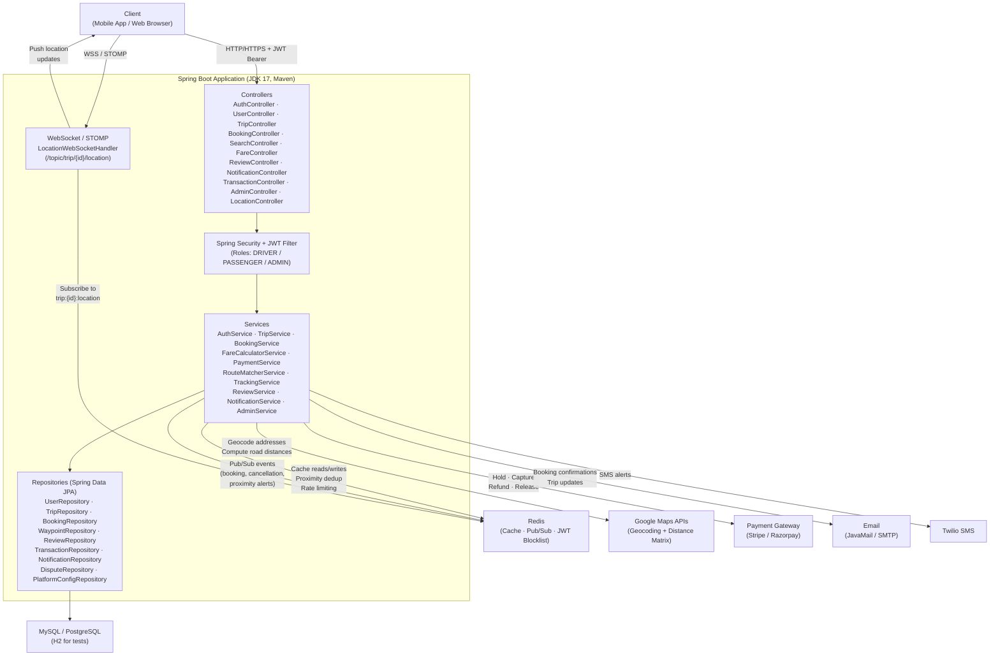

# Architecture Diagram

## Component Responsibilities

| Component | Technology | Responsibility |
|---|---|---|
| Controllers | `@RestController` | Handle HTTP requests; validate input; delegate to services |
| Security Filter | Spring Security + JWT | Authenticate every request; enforce role-based access |
| Services | `@Service` | Business logic; orchestrate repositories, external APIs, events |
| Repositories | Spring Data JPA | All database interactions via Hibernate; no raw SQL |
| WebSocket Handler | Spring WebSocket + STOMP | Push real-time driver location to connected passengers |
| MySQL / PostgreSQL | JPA `@Entity` | Primary persistent store for all domain data |
| Redis Cache | `RedisTemplate` | Proximity alert deduplication, rate limiting, metrics cache |
| Redis Pub/Sub | `RedisMessageListenerContainer` | Decouple location updates from WebSocket fan-out; notification dispatch |
| Redis JWT Blocklist | `RedisTemplate` | Store invalidated JWT tokens on logout |
| Google Maps APIs | `RestTemplate` | Geocode addresses; compute road distances between waypoints |
| Payment Gateway | Stripe / Razorpay SDK | Tokenize payments; process holds, captures, and refunds |
| JavaMail / SMTP | `JavaMailSender` | Deliver email notifications |
| Twilio SMS | Twilio SDK | Deliver SMS notifications |

## API Documentation

Swagger UI is available at `/swagger-ui.html` when the application is running.  
OpenAPI spec (JSON) is available at `/api-docs`.

All endpoints require a JWT Bearer token in the `Authorization` header except:
- `POST /auth/register`
- `POST /auth/login`
- `POST /auth/password-reset/request`
- `POST /auth/password-reset/confirm`
