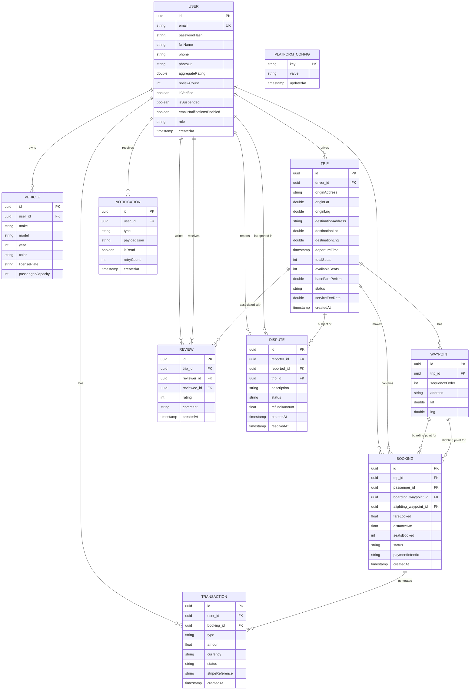

# Entity-Relationship Diagram

## Key Constraints

| Entity | Constraint |
|---|---|
| `USER.email` | Unique index |
| `REVIEW(trip_id, reviewer_id, reviewee_id)` | Unique constraint — prevents duplicate reviews |
| `BOOKING.fareLocked` | Set at confirmation time; `updatable = false` |
| `TRIP.serviceFeeRate` | Snapshotted at trip posting time; immune to admin config changes |
| `BOOKING.status` | Enum: `CONFIRMED`, `CANCELLED`, `PAYMENT_FAILED`, `COMPLETED` |
| `TRIP.status` | Enum: `OPEN`, `IN_PROGRESS`, `COMPLETED`, `CANCELLED` |
| `WAYPOINT.sequenceOrder` | 0 = origin, max = destination; intermediates 1–5 |
| `DISPUTE.status` | String: `OPEN`, `RESOLVED` |
